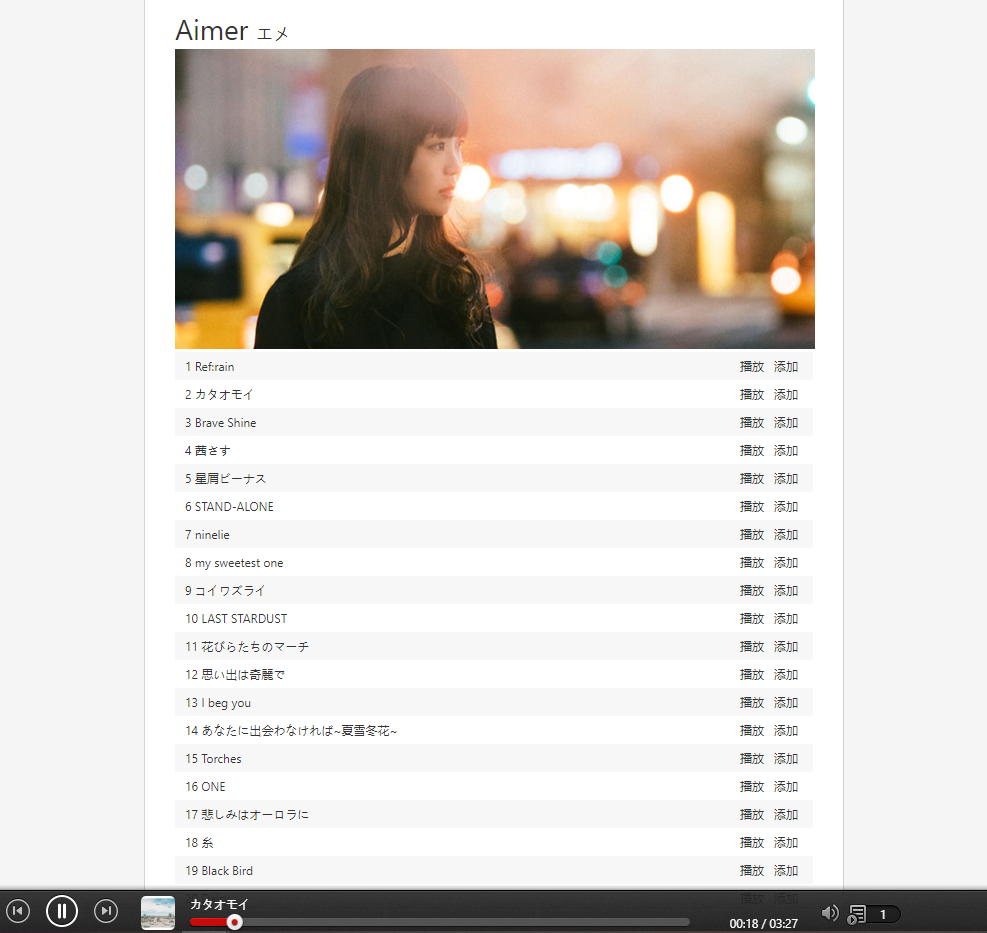

# react-study
**基于create-react-app, 仿写网易云web播放器学习react**
 
接口用的是[Binaryify大佬的 - NeteaseCloudMusicApi](https://github.com/Binaryify/NeteaseCloudMusicApi)

## 主要内容
1. 主要是对H5 audio标签的实践，在播放器中使用了部分audio相关api
2. 结合react-router，react-redux;
 
    

